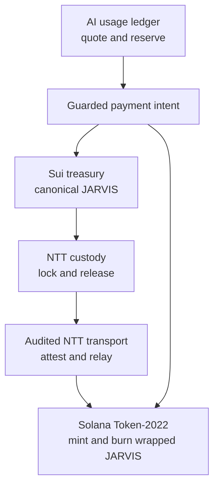

# Architecture

## System boundary

JARVIS uses one canonical fixed supply on Sui and a collateralized wrapped
representation on Solana. This repository supplies Move source, non-signing
TypeScript logic, guarded plan builders, validation, verification, metadata,
tests, and operational documentation. Established Wormhole NTT contracts
perform bridging; LLM providers perform inference; external custody performs
signing.



The local bridge and payment modules are deterministic policy/state-machine
components. They do not replace on-chain contracts, inspect finality, hold
keys, create cryptographic MPC shares, sign, or broadcast.

## Supply architecture

Publication of the Sui package mints the complete
`18,440,000,000,000,000` base-unit supply to the publishing treasury. The
package consumes the `TreasuryCap` into a frozen `FixedSupply` object. It has no
post-publication mint or burn entry point.

The Solana Token-2022 mint starts at zero. Its mint authority is the independently
verified NTT token-authority PDA. Wrapped minting is valid only after NTT locks
the same canonical amount on Sui. The reverse path burns wrapped units before
canonical release.

## Accounting invariants

At a finalized checkpoint:

```text
Sui circulating + Sui locked = 18,440,000,000,000,000
Solana wrapped + outbound in flight + return in flight = Sui locked
```

An operator must define transfer direction consistently when populating a
snapshot. A discrepancy is an incident, not an invitation to manually mint,
burn, or release funds.

## Responsibility boundaries

| Component | Responsible for | Explicitly not responsible for |
|---|---|---|
| Sui Move package | One-time supply creation and cap destruction | Bridging, governance, vesting |
| Token-2022 mint | Wrapped balances and metadata extension | Canonical supply creation |
| Wormhole NTT | Lock/mint and burn/release transport | JARVIS business allocation |
| TypeScript bridge logic | Policy validation and transfer state | Attestation cryptography or redemption |
| AI utility layer | Quotes, reservations, budgets, digests | Model inference or token minting |
| MPC policy model | Threshold authorization state | MPC key generation, custody, signing |
| Operator custody | Approval and signing ceremonies | Autonomous LLM access |

## Trust assumptions

- The reviewed Sui bytecode matches this source and the expected framework.
- The selected NTT version, peers, transceivers, modes, and authorities are
  authentic and correctly configured.
- Threshold custody remains uncompromised and roles are separated.
- Finalized state is checked through independent RPC providers.
- Relayers cannot bypass peer, threshold, replay, pause, or rate-limit controls.
- Metadata and public deployment records bind the correct package and mint.

Failure of an assumption must fail closed or trigger the incident procedure.

