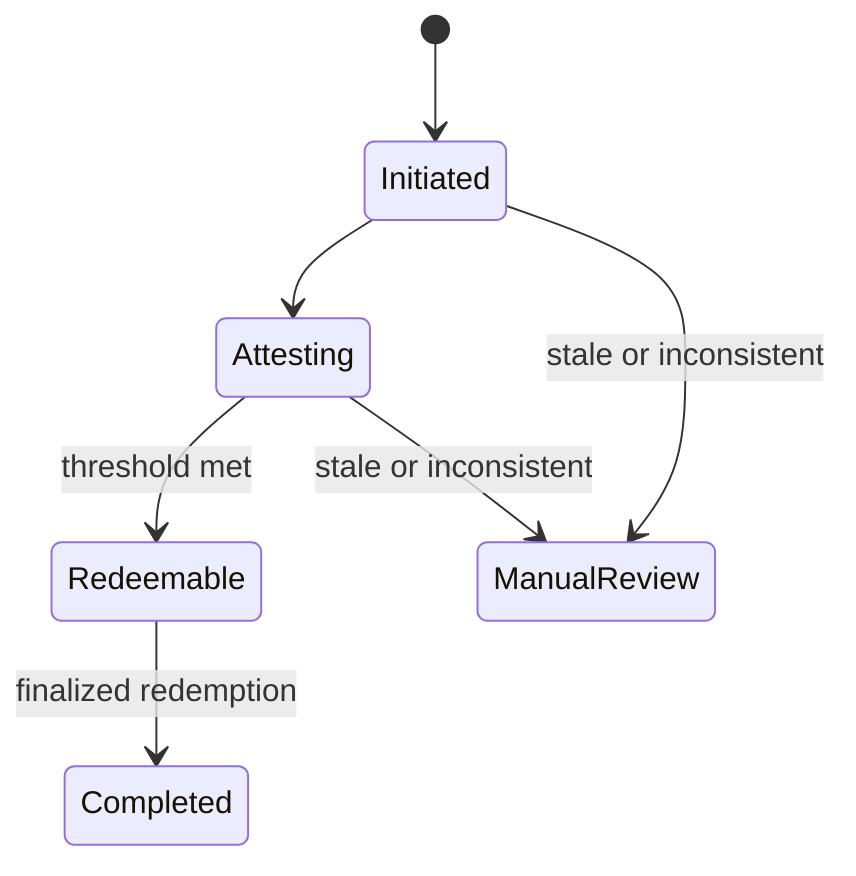

# Bridge operations

## Transfer lifecycle

| Direction | Source action | Destination action | Required backing |
|---|---|---|---|
| Sui → Solana | Lock canonical JARVIS | Mint wrapped JARVIS | Locked Sui amount equals minted amount |
| Solana → Sui | Burn wrapped JARVIS | Release canonical JARVIS | Burned amount equals released amount |

An established audited bridge integration authorizes mint and release. No
manual administrative mint or treasury release is an acceptable substitute.

## Before enabling transfers

- Verify package, mint, NTT manager, peer, transceiver, chain, and token-authority
  identities from two sources.
- Confirm Sui locking mode, Solana burning mode, threshold feasibility, replay
  protection, pause state, and conservative aggregate limits.
- Reconcile supply at a finalized checkpoint through independent RPCs.
- Confirm relayer monitoring, queue-age alerts, multisig access, and the incident
  channel are operational.

## Per-transfer checks

Track a durable transfer ID, canonical message digest, source transaction,
amount, direction, timestamps, unique authorized attestations, redemption
transaction, and terminal status. Never accept a caller-supplied completion flag
without finalized chain evidence.

The local state machine uses these states:



Items in manual review remain obligations and count as in flight. Do not mark
them cancelled merely because a relay failed or timed out.

## Reconciliation

Run reconciliation before limit changes, after deployments or upgrades, on a
regular production cadence, and immediately after an alert. Record finalized
checkpoint identifiers and raw observations from at least two RPC providers.

```bash
npm run jarvis -- verify-bridge-snapshot \
  --file snapshot.json \
  --out artifacts/bridge-report.json
```

The report must satisfy both canonical-supply and collateral equations. Explain
every in-flight item with a unique transfer ID and message digest.

## Monitoring

Alert on:

- any supply or collateral invariant mismatch;
- unexpected mint, burn, authority, peer, threshold, mode, or limit change;
- reused transfer/message/attestation identifiers;
- queue age or volume above policy;
- repeated attestation or redemption failures;
- RPC disagreement or finality regression;
- relayer unavailability and dependency advisories.

## Failure handling

Pause both directions and set limits to zero before diagnosing an unexplained
discrepancy. Preserve state, logs, transactions, messages, attestations, raw RPC
responses, and configuration. Do not delete queues, replay messages manually,
mint replacement units, or release collateral to make balances appear correct.
Follow [Incident response](incident-response.md).

